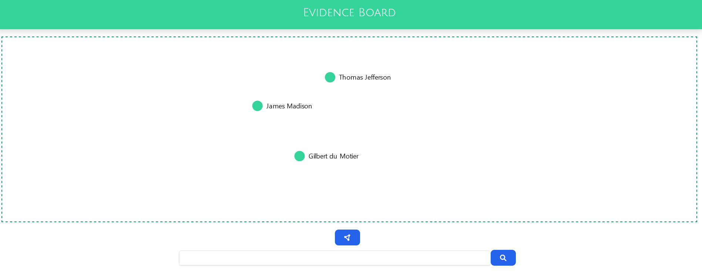
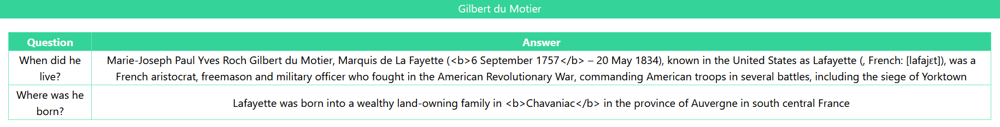
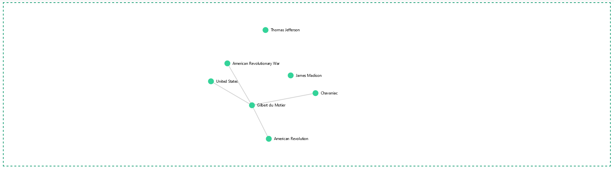

<h1 align="center">🔍 Link'It</h1>

<p align="center">
<a href="https://www.python.org"></a>
<a href="https://react.dev/"></a>
<a href="https://tailwindcss.com/"></a>
<a href="https://github.com/SimonPop/FindingMnemo/LICENSE"></a>
<a href="https://github.com/psf/black"></a>
<a href="https://docs.docker.com/compose/"></a>
</p>

Detective mini-game: Find the link between 3 randomly sampled Wikipedia page by asking questions.

## *How to run the app?*

### Using Docker

A `docker-compose` is available for this app. 

You can simply deploy it using:

```
docker compose up
```

### Using Local

If you want to avoir using `docker-compose`, it is still possible to run the app in local.

For that you have to follow the three following steps.

#### 1. Install dependencies

You first need to install dependencies using:

```
pip install -r requirements.txt
```

#### 2. Run backend application

To run the backend application (packaging the question-answer model), you will need to use the following command line from `src/back`:

```
uvicorn main:app --reload
```

#### 3. Install dependencies

Finally, the frontend application, from which the game can be played, can be run using the following command from `src/front`: 

```
npm start
```

### 3. Play 😊

The app should be running at `http://localhost:3000/` once all these  steps have been performed.



## *How to play the game*

The player begins with 3 unknown Wikipedia pages that all share at least common point (a fourth page from which all pages have been originally linked). 

By asking questions about the pages, the player can gain insight about the page content and therefore try to find the common page shared by all initial points.



Everytime an answer to a question includes a Wikipedia hyperlink, another page is made available to the player, thus creating a kind of evidence board.



The game ends when the player has found the root page and linked it to every initial pages.


## Technical Documentation

### Data

The data used comes from Wikipedia which is queried through its Python api `wikipediaapi`. 

### Question-Answering model

The NLP model behind this game comes from [HuggingFace](https://huggingface.co/).

More specifically it is a [Distilled BERT](https://huggingface.co/distilbert-base-cased-distilled-squad) trasnformer model for question-answers.

Only a pre-trained model has been used since no supervised data has been acquired, and the model already has a good enough performance.

[FastAPI](https://fastapi.tiangolo.com/) is used to package and serve the model as well as keeping a graph data structure up to date throughout the game.

### Win condtition

Throughout the game, the same graph as displayed on screen is kept up to date in the background. Whenever a new resquest is made and links added to that graph, it is verified whether or not victory has been reached. The winning condition is validated when this graph is finally [connected](https://mathworld.wolfram.com/ConnectedGraph.html), one way or another.

> In a second version, we might add a secondary objective: finding __the__ original page that linked to the sampling of these pages. 

### Web application

The application uses ReactJs, Tailwind CSS and is built around a D3.js network using [react-d3-graph](https://github.com/danielcaldas/react-d3-graph).

## 🛣️ Roadmap

- Reload graph automatically at every question-answer. (Currently, the player needs to refresh it using the graph button).
- Allow to re-center the graph using the graph button (Currently, it only allows to refresh the graph).
- Add secondary objective.
